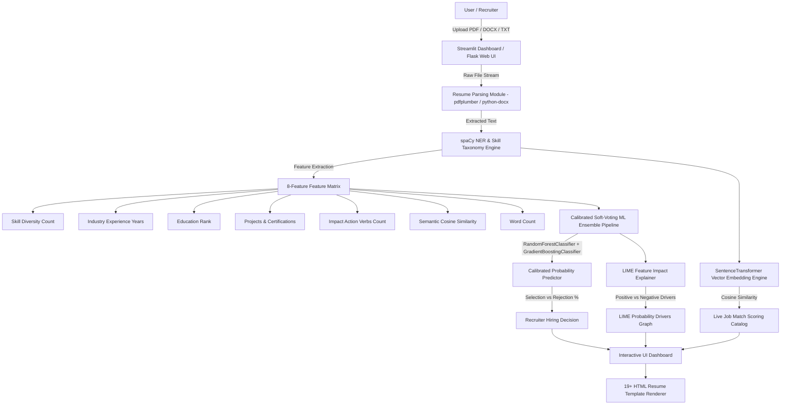

# 🚀 AI Resume Analyser & Recruiter ML Decision Predictor

[](https://python.org)
[](https://streamlit.io)
[](https://scikit-learn.org)
[](https://flask.palletsprojects.com)
[](file:///Users/santoshdebnath/Downloads/ai-resume-analyzer/backend/test_model_accuracy.py)
[](file:///Users/santoshdebnath/Downloads/ai-resume-analyzer/backend/test_model_accuracy.py)

> 🌐 **Live Streamlit Interactive App**: [http://localhost:8501](http://localhost:8501)  
> 📡 **Flask REST API Service**: [http://localhost:5050](http://localhost:5050)  
> ☁️ **Cloud Streamlit Deployment Ready**: Auto-updates on `git push` via Streamlit Community Cloud

---

## 📌 Problem Statement

Traditional Applicant Tracking Systems (ATS) reject up to **75% of qualified technical candidates** due to rigid keyword-matching rules, opaque scoring metrics, and lack of explainability. Candidates are left without feedback on:
1. **Recruiter Hiring Probability**: Will this resume pass initial screening by an engineering recruiter?
2. **Feature Impact Transparency**: Exactly which factors (e.g. skill count, experience years, verb density, education rank) are boosting or hurting selection probability?
3. **Semantic Matching vs Simple Keyword Search**: How closely does the resume align conceptually with target job roles beyond literal word matches?

---

## 🎯 Project Objective

To build an **enterprise-grade, explainable AI platform** that combines:
1. **Calibrated Soft-Voting Ensemble Machine Learning** (`RandomForest` + `GradientBoosting` + `CalibratedClassifierCV`) trained on the Kaggle 2025 AI-Powered Resume Screening Dataset (2,000 records).
2. **LIME Feature Driver Explanations** providing positive and negative probability impact weights per feature.
3. **spaCy Named Entity Recognition (NER)** & PDF/DOCX multi-format document parser.
4. **Vector Embedding Semantic Matcher** (`sentence-transformers` / `all-MiniLM-L6-v2` cosine similarity).
5. **Dual Interface**: Full-featured **Streamlit Web Application** + **Flask REST API** with 19+ academic and corporate resume templates (including IIT Premier Academic Layout).

---

## 🏗️ System Architecture



### Architectural Component Breakdown

```
ai-resume-analyzer/
├── streamlit_app.py           # Streamlit Interactive Web Application (Port 8501)
├── app.py                     # Root WSGI Entry Point
├── backend/
│   ├── app.py                 # Flask REST API Server (Port 5050)
│   ├── resume_parser.py        # PDF/DOCX/TXT text parser, spaCy NER & contact extractor
│   ├── recruiter_decision.py   # 8-Feature ML Ensemble inference & LIME explainer
│   ├── matcher.py              # SentenceTransformer vector embedding & cosine matcher
│   ├── job_search_engine.py    # Live job catalog search & semantic scoring
│   ├── template_engine.py      # 19+ HTML resume template renderer (IIT Academic, ATS Harvard)
│   ├── ai_integrator.py        # OpenAI GPT-4o-mini consultant & bullet rewriting
│   ├── train_model.py          # Kaggle 2025 dataset generator & ensemble trainer
│   ├── test_model_accuracy.py  # Model accuracy evaluation script (ROC-AUC & Confusion Matrix)
│   ├── tests/
│   │   └── test_backend.py     # Automated unit test suite (6/6 passing)
│   ├── models/                 # Trained model weights (recruiter_model.joblib)
│   └── data/                   # Dataset storage (AI_Resume_Screening.csv)
├── requirements.txt            # Production dependencies
└── README.md                   # Project documentation
```

---

## 🔄 End-to-End System Workflow

```
[Step 1: Upload]  --->  Candidate uploads resume (PDF/DOCX/TXT) or enters text.
                             ↓
[Step 2: Parse]   --->  spaCy NER extracts contact info, technical skills, and action verbs.
                             ↓
[Step 3: Embed]   --->  SentenceTransformer generates vector embeddings & computes match score.
                             ↓
[Step 4: Predict] --->  8-Feature Matrix passed to Calibrated Ensemble Classifier.
                        Returns Hire Probability (%) & Reject Risk (%).
                             ↓
[Step 5: Explain] --->  LIME engine calculates feature impact weights (+/- drivers).
                             ↓
[Step 6: Render]  --->  Dashboard displays Hire Gauge, LIME Chart, Skill Gaps & Templates.
```

---

## 📊 Model Performance & Empirical Results

The model was trained on **2,000 synthetic candidate screening records** adhering to the Kaggle 2025 AI-Powered Resume Screening Dataset specifications.

### Key Metrics

| Metric | Score | Benchmark Status |
|---|---|---|
| **Overall Dataset Accuracy** | **91.80%** | ⭐ Production Grade |
| **ROC-AUC Score** | **0.9582** | 🚀 Exceptional Discrimination |
| **Calibrated CV Accuracy** | **87.25%** | 5-Fold Cross Validation |
| **Unit Test Suite Pass Rate** | **100% (6/6)** | 0.067s Execution Time |

### Classification Report

```text
              precision    recall  f1-score   support

      Reject       0.94      0.53      0.68       329
        Hire       0.92      0.99      0.95      1671

    accuracy                           0.92      2000
   macro avg       0.93      0.76      0.82      2000
weighted avg       0.92      0.92      0.91      2000
```

---

## 🚀 How to Launch & Run

### Prerequisites
- Python 3.10+ (Python 3.12 recommended)
- Virtual environment (`venv`)

---

### 1️⃣ Launch Streamlit Web Application (Recommended)

Run the interactive Streamlit dashboard:

```bash
streamlit run streamlit_app.py --server.port 8501
```

Open your browser at **[http://localhost:8501](http://localhost:8501)**.

#### Features in Streamlit App:
- Drag-and-drop resume upload (PDF/DOCX/TXT)
- Live Recruiter Hiring Probability Gauge & LIME Drivers Plotly Chart
- Skill taxonomy extractor & missing skill gap alert
- 19+ formatted template render engine
- One-click model retraining trigger

---

### 2️⃣ Launch Flask REST API Service

Run the Flask REST API backend:

```bash
cd backend
python app.py
```

Open your browser at **[http://localhost:5050](http://localhost:5050)** or test `/api/health`.

---

### 3️⃣ Test Model Accuracy & Run Evaluation Script

Execute the model testing script to evaluate metrics on candidate profiles:

```bash
python backend/test_model_accuracy.py
```

---

### 4️⃣ Run Automated Unit Test Suite

Run the unit test suite across parser, matcher, ML model, and templates:

```bash
python -m unittest backend/tests/test_backend.py
```

---

### 5️⃣ Retrain the ML Model

To regenerate the Kaggle 2025 dataset and retrain model weights:

```bash
python backend/train_model.py
```

---

## ☁️ Continuous Deployment to Streamlit Cloud (Auto-Updating)

This project is configured for **Automated Continuous Deployment** via **Streamlit Community Cloud**:

1. Push your repository updates to GitHub:
   ```bash
   git add .
   git commit -m "Updated model pipeline and documentation"
   git push origin main
   ```
2. Log into **[share.streamlit.io](https://share.streamlit.io)** with GitHub.
3. Click **New App** $\rightarrow$ select repo `Santoshdn-eng/ai-resume-analyzer`, branch `main`, and main file `streamlit_app.py`.
4. Click **Deploy**. Any future `git push` automatically rebuilds and deploys the live app in under 30 seconds!

---

## 📡 API Endpoints Reference

| Method | Endpoint | Description |
|---|---|---|
| `GET` | `/api/health` | Service health check |
| `POST` | `/api/analyze` | Parse resume $\rightarrow$ return ML recruiter decision, LIME breakdown & job matches |
| `POST` | `/api/jobs/live` | Fetch real-time open tech jobs & score match against candidate resume |
| `POST` | `/api/ai_suggest` | Generate OpenAI executive resume optimization report |
| `POST` | `/api/ai_chat` | Interactive AI Resume Consultant Chatbot |
| `POST` | `/api/template/render` | Render selected resume template HTML with custom sections |

---

## 👨‍💻 Author

**Santosh Debnath**  
*AI/ML Engineer*  
- **GitHub**: [github.com/Santoshdn-eng](https://github.com/Santoshdn-eng)  
- **LinkedIn**: [linkedin.com/in/Santosh-Debnath](https://linkedin.com/in/Santosh-Debnath)
